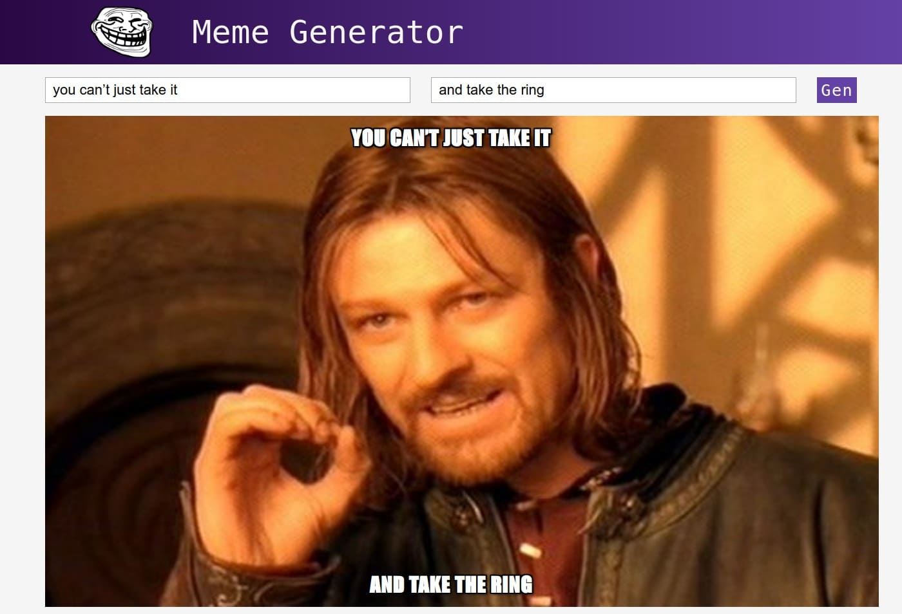
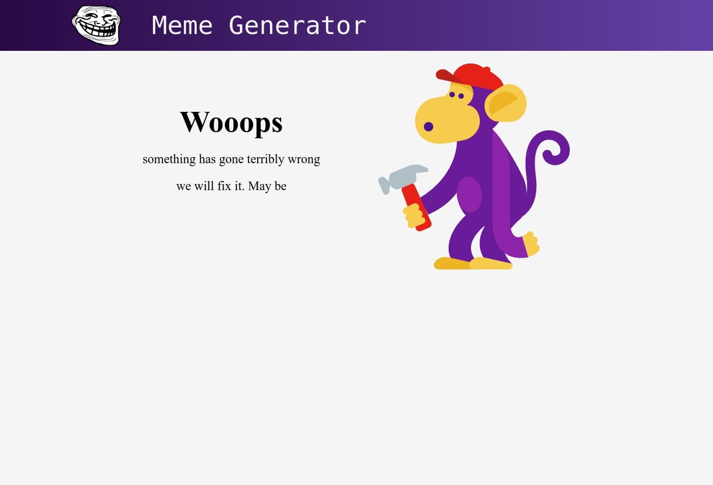

# React TypeScript meme generator

It is simple code example TypeScript in React.js
I don't use Router, Redux or other library, only react and TS.

If you want to start the project, install build configuration [react-create-app](https://github.com/facebook/create-react-app "react-create-app") and run ***npm install*** for install all dependencies

All data I get from [api.imgflip.com](https://api.imgflip.com/get_memes) API

I use [react-epic-spinners](https://bondz.github.io/react-epic-spinners/) as load indicator

The project is implemented the server error handling and error code.
There's a data download indicator with the API.

I use useState and useEffect HOCs instead setState wherever it possible

